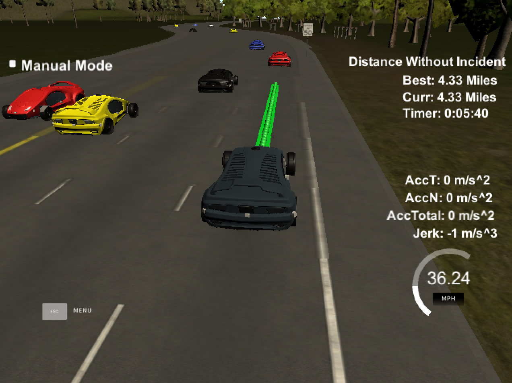
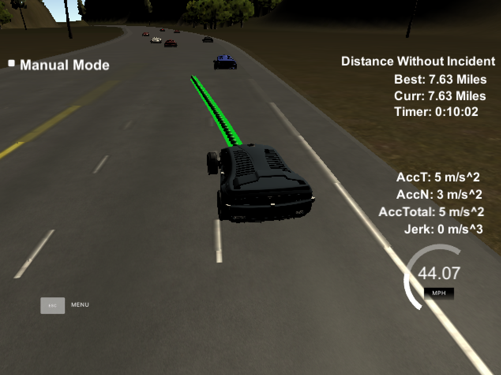

# **Path Planning**

Project to plan the path of a vehicle and decide when to change lanes.

Build guide: [BUILD.md](BUILD.md)  
Source code: [src/](src/)  
Model documentation: [ModelDocumentation.md](ModelDocumentation.md)

## Path Planning reaching 4.33 Miles and after 10 Minutes:

 
